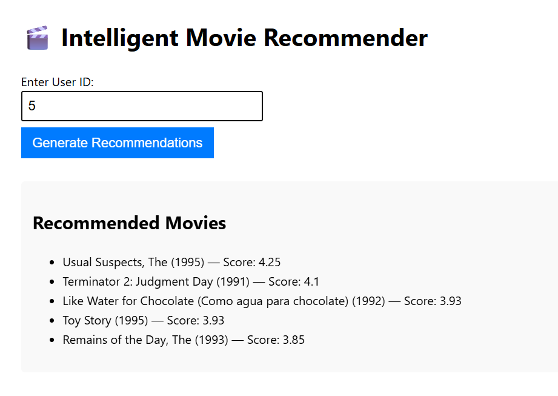
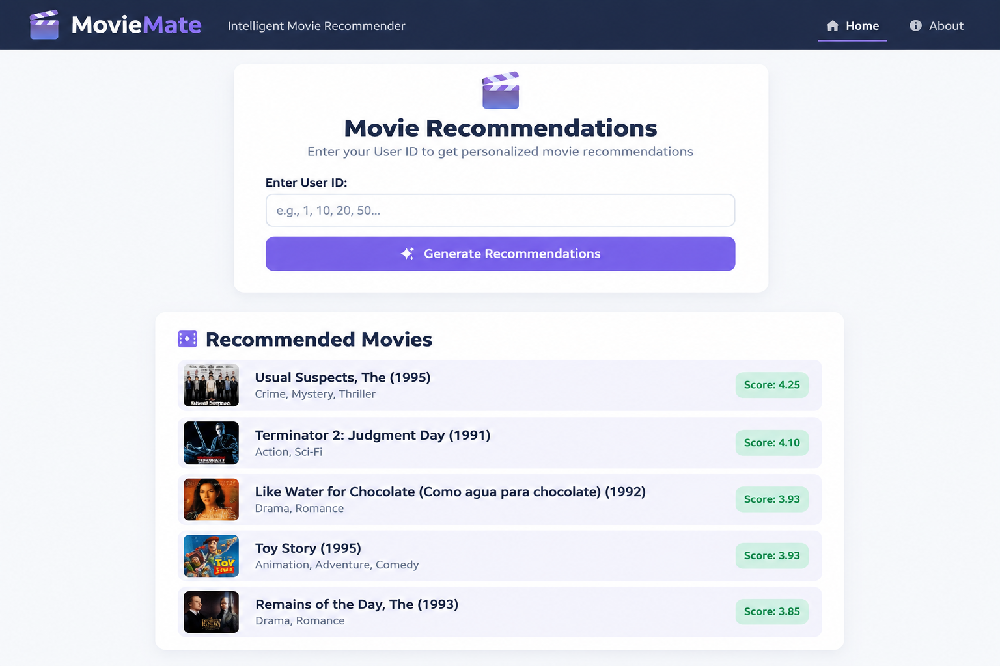

# 🎬 MovieMate — Intelligent Movie Recommendation System

MovieMate is a personalized **movie recommendation system** built using Python and machine learning. It uses **Collaborative Filtering with SVD (Singular Value Decomposition)** through the `scikit-surprise` library to generate personalized movie recommendations for users.

The project also includes a lightweight **Flask web application** that allows users to enter their User ID and receive recommended movies with predicted ratings.

---

## 📸 Screenshots

### 🏠 MovieMate Interface



### 🎬 Movie Recommendations



---

## ✨ Features

- 🎯 Personalized movie recommendations
- 📊 Collaborative Filtering using SVD
- ⭐ Predicts movie ratings for users
- 🏆 Generates Top-N movie recommendations
- 🧠 Handles user-movie mapping
- 🌐 Interactive Flask web interface
- 📈 Exploratory Data Analysis using Jupyter Notebook
- 🧩 Modular Python code structure
- ⚡ Fast recommendation generation
- 📱 Simple and responsive frontend

---

## 🛠️ Tech Stack

### Backend & Machine Learning

- **Python 3.11**
- **Flask**
- **Pandas**
- **NumPy**
- **Scikit-learn**
- **Scikit-Surprise**
- **Matplotlib**
- **Seaborn**

### Frontend

- **HTML5**
- **CSS3**
- **JavaScript**
- **Jinja Templates**

### Machine Learning Algorithm

- **Collaborative Filtering**
- **SVD (Singular Value Decomposition)**

---

## 📂 Project Structure

```text
MovieMate/
│
├── data/
│   ├── movies.csv
│   └── ratings.csv
│
├── notebooks/
│   └── eda.ipynb
│
├── src/
│   ├── collaborative_filtering.py
│   ├── content_based_filtering.py
│   ├── data_loader.py
│   ├── evaluation_metrics.py
│   ├── preprocessing.py
│   └── topn_recommendation.py
│
├── web/
│   ├── app.py
│   └── templates/
│       ├── index.html
│       └── results.html
│
├── screenshots/
│   ├── home.png
│   └── recommendations.png
│
├── .gitignore
├── LICENSE
├── README.md
├── render.yaml
└── requirements.txt
```

---

## 🧠 How It Works

MovieMate follows a simple recommendation pipeline:

```text
             MovieLens Dataset
                    │
                    ▼
            Data Preprocessing
                    │
                    ▼
          User-Movie Rating Matrix
                    │
                    ▼
        Collaborative Filtering
                    │
                    ▼
              SVD Model
                    │
                    ▼
        Predict Unseen Movie Ratings
                    │
                    ▼
             Sort Predictions
                    │
                    ▼
             Top-N Movies
                    │
                    ▼
             Flask Web App
                    │
                    ▼
          Recommended Movies
```

### Recommendation Process

1. Load movie and rating datasets.
2. Preprocess the rating information.
3. Train the SVD collaborative filtering model.
4. Select movies that the user has not rated.
5. Predict ratings for those movies.
6. Sort movies according to predicted ratings.
7. Return the Top-N recommendations.
8. Display the recommendations through the Flask web interface.

---

## 📊 Dataset

This project uses the **MovieLens 100K dataset**.

The dataset contains:

- User IDs
- Movie IDs
- Movie titles
- User ratings
- Movie information

### Dataset Source

**GroupLens Research — MovieLens**

https://grouplens.org/datasets/movielens/100k/

---

## 🧪 Sample User IDs

You can test the application using the following User IDs:

```text
1
10
20
50
75
```

For example:

```text
User ID: 1
```

The system will generate the highest predicted movie ratings for that user.

---

## ⚙️ Installation & Setup

### 1. Clone the Repository

```bash
git clone https://github.com/Ayu-koda/MovieMate.git
```

Move into the project directory:

```bash
cd MovieMate
```

---

### 2. Create a Virtual Environment

It is recommended to use a virtual environment.

```bash
python -m venv venv
```

Activate it on Windows:

```powershell
.\venv\Scripts\Activate.ps1
```

If activation is successful, you should see:

```text
(venv)
```

in your terminal.

---

### 3. Install Dependencies

Install all required Python packages:

```bash
pip install -r requirements.txt
```

---

## ▶️ Running the Application

From the root `MovieMate` directory, run:

```bash
python web/app.py
```

You should see something similar to:

```text
* Running on http://127.0.0.1:5000
```

Open your browser and visit:

```text
http://127.0.0.1:5000
```

---

## 🎬 Using MovieMate

1. Open the MovieMate web application.
2. Enter a valid User ID.
3. Click **Generate Recommendations**.
4. The system predicts movie ratings.
5. The highest-rated unseen movies are displayed as recommendations.

Example:

```text
User ID: 1

Recommended Movies

L.A. Confidential (1997) — Score: 5.00
Monty Python and the Holy Grail (1975) — Score: 5.00
Back to the Future (1985) — Score: 5.00
Jungle Book, The (1967) — Score: 4.92
Fight Club (1999) — Score: 4.85
```

---

## 🔌 API

MovieMate also provides an API endpoint for generating recommendations.

### Endpoint

```text
GET /api/recommend?userId=<USER_ID>
```

### Example

```bash
curl "http://127.0.0.1:5000/api/recommend?userId=1"
```

### Example Response

```json
{
  "recommendations": [
    {
      "movieTitle": "L.A. Confidential (1997)",
      "score": 5.0
    },
    {
      "movieTitle": "Monty Python and the Holy Grail (1975)",
      "score": 5.0
    },
    {
      "movieTitle": "Back to the Future (1985)",
      "score": 5.0
    }
  ]
}
```

---

## 📈 Machine Learning Model

MovieMate uses **SVD (Singular Value Decomposition)** for collaborative filtering.

The model learns hidden patterns from the user-movie rating matrix and predicts how a user might rate movies they haven't watched or rated yet.

### Why SVD?

SVD is useful for recommendation systems because it can:

- Learn latent user preferences
- Learn hidden movie characteristics
- Handle sparse rating matrices
- Predict missing ratings
- Generate personalized recommendations

---

## 📁 Main Components

### `data_loader.py`

Responsible for loading the movie and rating datasets.

### `preprocessing.py`

Handles data cleaning and preprocessing before model training.

### `collaborative_filtering.py`

Contains the collaborative filtering implementation using SVD.

### `content_based_filtering.py`

Contains functionality related to content-based recommendation techniques.

### `topn_recommendation.py`

Generates and ranks the Top-N movie recommendations.

### `evaluation_metrics.py`

Contains evaluation-related functionality for measuring recommendation performance.

### `web/app.py`

Flask backend responsible for:

- Serving the web application
- Receiving User IDs
- Generating recommendations
- Returning recommendation results through the API

---

## 📓 Exploratory Data Analysis

The project includes a Jupyter Notebook:

```text
notebooks/eda.ipynb
```

It is used to explore:

- Movie ratings
- User activity
- Rating distributions
- Dataset characteristics
- Movie popularity

---

## 🔮 Future Improvements

Some possible improvements for MovieMate include:

- 🎭 Improve content-based filtering
- 🤝 Combine collaborative and content-based filtering
- 🧠 Implement hybrid recommendation
- 🔐 Add user authentication
- ⭐ Allow users to rate movies directly
- ❤️ Add favorite movies
- 📜 Add recommendation history
- 🎨 Improve the frontend UI
- 🌙 Add dark/light mode
- 📱 Improve mobile responsiveness
- ⚡ Optimize recommendation speed
- ☁️ Deploy the application online
- 📊 Add recommendation analytics
- 🔍 Add movie search functionality

---

## 🚀 Deployment

The project includes a:

```text
render.yaml
```

configuration file for deployment using **Render**.

The Flask application can be configured to run using the environment-provided `PORT`.

---

## 📌 Learning Objectives

This project was created as a hands-on learning project to understand:

- Machine Learning
- Recommendation Systems
- Collaborative Filtering
- Matrix Factorization
- SVD
- Data preprocessing
- Python modular programming
- Flask
- REST APIs
- HTML/CSS/JavaScript
- Jinja templates
- Git & GitHub
- Project deployment

---

## 🤝 Contributing

Contributions, suggestions, and improvements are welcome.

If you want to contribute:

1. Fork the repository.
2. Create a new branch.
3. Make your changes.
4. Commit your changes.
5. Push the branch.
6. Open a Pull Request.

---

## 📜 License

This project is licensed under the terms specified in the `LICENSE` file.

---

## 👨‍💻 Author

**Ayush**

Built with ❤️ as a hands-on machine learning and recommendation-system project.

---

⭐ If you found this project useful, consider giving the repository a star!

**GitHub:** https://github.com/Ayu-koda/MovieMate
